# Unibase AIP Quick Reference

Quick commands and reference for deploying HyperClaw agents on Unibase AIP.

## 📦 Environment Setup

```bash
# Required variables
export AIP_ENDPOINT="http://api.aip.unibase.com"
export GATEWAY_URL="http://gateway.aip.unibase.com"
export MEMBASE_ACCOUNT="0x5ea13664c5ce67753f208540d25b913788aa3daa"  # Test account

# Optional (for DIRECT mode)
export AGENT_PUBLIC_URL="https://your-domain.com/api/unibase"
export AIP_DEPLOYMENT_MODE="POLLING"  # or "DIRECT"
```

## 🚀 Deployment Commands

### Private Mode (Behind Firewall)
```bash
# Single agent
npm run deploy:aip:private -- --agent-id agent_abc123

# All active agents
npm run deploy:aip:private -- --all

# Custom polling interval (3 seconds)
npm run deploy:aip:private -- --agent-id agent_abc123 --poll-interval 3
```

### Public Mode (Production)
```bash
# Single agent
npm run deploy:aip:public -- \
  --agent-id agent_abc123 \
  --endpoint https://hyperclaw.com/api/unibase

# All active agents
npm run deploy:aip:public -- \
  --all \
  --endpoint https://hyperclaw.com/api/unibase
```

## 🔧 API Endpoints

### Register Agent
```bash
curl -X POST http://localhost:3000/api/unibase/register \
  -H "Content-Type: application/json" \
  -d '{
    "hyperClawAgentId": "agent_abc123",
    "mode": "POLLING",
    "publicEndpoint": "https://domain.com/api/unibase/invoke/agent_abc123"
  }'
```

### Register All Active Agents
```bash
curl -X POST http://localhost:3000/api/unibase/register \
  -H "Content-Type: application/json" \
  -d '{
    "registerAll": true,
    "mode": "DIRECT",
    "publicEndpoint": "https://domain.com/api/unibase"
  }'
```

### List Registered Agents
```bash
curl http://localhost:3000/api/unibase/agents
```

### Health Check
```bash
curl http://localhost:3000/api/unibase/health
```

### Invoke Agent (Testing)
```bash
curl -X POST http://localhost:3000/api/unibase/invoke/aip_agent_xyz \
  -H "Content-Type: application/json" \
  -d '{
    "message": "What is your BTC analysis?",
    "user_id": "user:test",
    "payment_verified": true
  }'
```

### Poll for Tasks (POLLING mode)
```bash
curl -X POST http://localhost:3000/api/unibase/poll \
  -H "Content-Type: application/json" \
  -d '{ "agent_id": "aip_agent_xyz" }'
```

## 🎯 Common User Queries

### Market Analysis
```
"What's your analysis on BTC?"
"Tell me about ETH market conditions"
"What are the current market trends?"
```

### Trading Decisions
```
"Give me a trade recommendation"
"Should I long or short BTC?"
"What's your BTC trade?"
```

### Portfolio Status
```
"What's my current position?"
"Show me the portfolio performance"
"What's the PnL?"
```

## 💰 Pricing Calculation

```javascript
base_call_fee = base_fee × autonomy_multiplier × risk_multiplier

Where:
  base_fee = 0.005 (semi-auto) or 0.01 (full-auto)
  autonomy_multiplier = 1.0 (semi) or 2.0 (full)
  risk_multiplier = 1.0 (conservative) | 1.2 (moderate) | 1.5 (aggressive)

Examples:
  Conservative + Semi = $0.005/call
  Moderate + Full    = $0.012/call
  Aggressive + Full  = $0.015/call
```

## 🏗️ Agent Configuration Template

```typescript
{
  name: "Agent Name",
  description: "Agent description",
  markets: ["BTC", "ETH", "SOL"],
  maxLeverage: 5,
  riskLevel: "moderate",  // conservative | moderate | aggressive
  stopLossPercent: 5,
  autonomy: {
    mode: "semi",  // full | semi | manual
    aggressiveness: 50,  // 0-100
    maxTradesPerDay: 10,
    approvalTimeoutMs: 300000,  // 5 minutes
  },
  isOpenVault: false,
  telegramChatId: "optional_telegram_chat_id",
}
```

## 📊 Skill IDs

```
trading.analysis     - Market analysis and conditions
trading.decision     - AI-powered trade recommendations
portfolio.status     - Current positions and performance
```

## 🔍 Debugging

### Check Agent Status
```bash
curl http://localhost:3000/api/agents/agent_abc123 | jq
```

### Check Agent HL Balance
```bash
curl http://localhost:3000/api/market | jq '.balances'
```

### Trigger Manual Tick
```bash
curl -X POST http://localhost:3000/api/agents/agent_abc123/tick
```

### View Registered AIP Agents
```bash
curl http://localhost:3000/api/unibase/agents | jq '.agents[] | {name, handle, mode, cost_model}'
```

## 📝 File Structure

```
lib/
  unibase-aip.ts              # Core integration
  unibase-agent-configs.ts    # Example configs

app/api/unibase/
  register/route.ts           # POST - Register agents
  invoke/[agentId]/route.ts   # POST - A2A invocation
  agents/route.ts             # GET - List agents
  poll/route.ts               # POST - Gateway polling
  health/route.ts             # GET - Health check

scripts/
  deploy-public-agents.mjs    # Deploy DIRECT mode
  deploy-private-agents.mjs   # Deploy POLLING mode
```

## 🎨 Response Format

### Market Analysis
```json
{
  "content": "📈 **Market Analysis for BTC**\n\n...",
  "metadata": {
    "type": "market_analysis",
    "markets": [...]
  }
}
```

### Trading Decision
```json
{
  "content": "🤖 **Trading Decision**\n\n**Action:** LONG\n...",
  "metadata": {
    "type": "trading_decision",
    "decision": {
      "action": "long",
      "asset": "BTC",
      "confidence": 0.78,
      ...
    }
  },
  "memory_update": {
    "last_decision": {...},
    "timestamp": 1707409800000
  }
}
```

### Portfolio Status
```json
{
  "content": "📊 **Portfolio Status**\n\n...",
  "metadata": {
    "type": "portfolio_status",
    "totalEquity": 10500.25,
    "positions": [...]
  }
}
```

## 🔐 Security Notes

- ✅ Test account: `0x5ea13664c5ce67753f208540d25b913788aa3daa`
- ✅ Never commit `.env` files
- ✅ Use HTTPS for public endpoints
- ✅ Gateway handles payment verification in production
- ✅ Local testing bypasses payment verification

## 🌐 Deployment Modes Comparison

| Feature | DIRECT | POLLING |
|---------|--------|---------|
| Public endpoint | ✅ Required | ❌ Not needed |
| Latency | 🟢 Low | 🟡 Moderate |
| Firewall friendly | ❌ No | ✅ Yes |
| Security | 🟡 Standard | 🟢 Enhanced |
| Use case | Production | Development/Private |

## 📚 Documentation Links

- **[UNIBASE_AIP.md](./UNIBASE_AIP.md)** - Complete guide
- **[INTEGRATION_SUMMARY.md](./INTEGRATION_SUMMARY.md)** - Overview
- **[README.md](./README.md#unibase-aip-integration)** - Quick intro
- **[lib/unibase-agent-configs.ts](./lib/unibase-agent-configs.ts)** - Examples

## ⚡ Troubleshooting

### "Agent not found"
→ Check agent exists: `curl http://localhost:3000/api/agents/agent_abc123`
→ Verify agent is registered: `curl http://localhost:3000/api/unibase/agents`

### "Payment verification failed"
→ Check MEMBASE_ACCOUNT is set
→ For local testing, `payment_verified` is bypassed automatically

### "No tasks" (POLLING mode)
→ Verify agent is registered in POLLING mode
→ Check Gateway connectivity
→ Try faster polling interval

### "Endpoint not accessible" (DIRECT mode)
→ Verify firewall allows inbound HTTPS
→ Test with: `curl https://your-domain.com/api/unibase/invoke/agent_abc123`
→ Check SSL certificate is valid

## 🚦 Deployment Workflow

```mermaid
graph TD
    A[Create HyperClaw Agent] --> B[Fund Agent HL Wallet]
    B --> C{Choose Mode}
    C -->|Development| D[Deploy POLLING Mode]
    C -->|Production| E[Deploy DIRECT Mode]
    D --> F[Run Polling Script]
    E --> G[Start Web Server]
    F --> H[Test Invocation]
    G --> H
    H --> I[Monitor Logs]
    I --> J{Working?}
    J -->|Yes| K[🎉 Success!]
    J -->|No| L[Check Troubleshooting]
    L --> I
```



---

**Quick help:**
```bash
# Show deployment help
npm run deploy:aip:public -- --help
npm run deploy:aip:private -- --help

# Test health
curl http://localhost:3000/api/unibase/health

# List agents
curl http://localhost:3000/api/unibase/agents | jq
```
