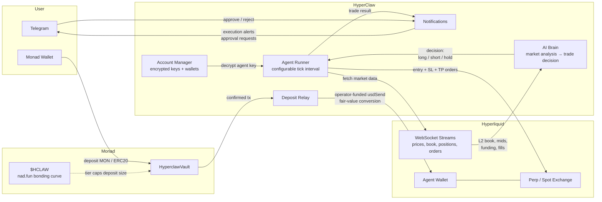
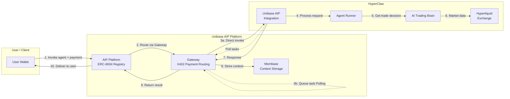

# HyperClaw

AI-powered autonomous trading agents on Hyperliquid, funded through on-chain vaults on Monad.

Users deposit into Monad smart contract vaults. Capital is relayed to Hyperliquid. AI agents trade perpetual futures autonomously, with configurable autonomy levels, risk parameters, and real-time monitoring. A native `$HCLAW` token governs deposit caps via a bonding-curve tier system.

---

## Table of Contents

- [Architecture](#architecture)
- [Core Concepts](#core-concepts)
- [Unibase AIP Integration](#unibase-aip-integration)
- [Tech Stack](#tech-stack)
- [HCLAW Launch Stack](#hclaw-launch-stack)
- [Pages and UI](#pages-and-ui)
- [API Surface](#api-surface)
- [Smart Contract](#smart-contract)
- [Project Structure](#project-structure)
- [Documentation Index](#documentation-index)
- [Environment Variables](#environment-variables)
- [Setup](#setup)
- [Running](#running)
- [Deployment](#deployment)
- [Testnet Trading](#testnet-trading)

---

## Architecture



**Data flow:**

1. User deposits MON or ERC20 into `HyperclawVault` on Monad. `$HCLAW` market cap sets the deposit cap tier.
2. Deposit relay picks up the confirmed tx and funds the agent wallet:
   - both networks: operator `usdSend` direct to the agent HL wallet (no bridge on deposit)
   - fair-value conversion: MON/ERC20 amount -> USDC relay amount via oracle/feed pricing
3. Agent runner ticks on a configurable interval. Each tick: pulls live market data from Hyperliquid WebSocket streams, passes it to the AI brain, receives a structured trade decision.
4. If confidence exceeds the agent's threshold, the runner places a full order set (market entry + stop-loss + take-profit) on Hyperliquid using the agent's own wallet.
5. In semi-auto mode, the decision is sent to Telegram first as an approval request. The user approves or rejects via inline buttons before execution.
6. All trades, decisions, and state are persisted and streamed to the frontend via SSE.

---

## Core Concepts

### Agents

Each agent is an independent trading entity with:

- **Dedicated Hyperliquid wallet** with dual signing modes:
  - **PKP (Programmable Key Pair)**: Distributed signing via Lit Protocol with cryptographic constraints
  - **Traditional**: AES-256 encrypted private key storage
- **Market selection** (perps and/or spot, e.g. BTC, ETH, SOL)
- **Risk parameters**: max leverage (1-50x), stop loss (1-25%), aggressiveness (0-100)
- **Autonomy mode**:
  - `full_auto` -- executes trades without human intervention
  - `semi_auto` -- requests approval via Telegram before executing
  - `manual` -- AI suggests, human executes
- **Status**: active, paused, stopped
- **Autonomous execution**: The agent runner automatically detects wallet type and uses appropriate signing method (PKP or traditional) for all trading operations including entries, stop-losses, and take-profits

### Vault System

- Share-based accounting on-chain via `HyperclawVault.sol`
- Multi-token deposits (native MON + stablecoins like USDC/USDT)
- Deposit caps scale with `$HCLAW` market cap:

| Tier      | Market Cap Threshold | Max Deposit per User |
|-----------|---------------------|---------------------|
| Hatchling | $0                  | $100                |
| Hunter    | $1,000              | $1,000              |
| Striker   | $10,000             | $10,000             |
| Apex      | $100,000            | $100,000            |

- Open Vault mode: public chat room for depositors, AI responds to investor questions

### HCLAW Launch Stack

The HCLAW Monad/nad.fun integration includes:

- `HclawLock.sol`: lock lifecycle + linearly decaying `HCLAW Power`
- `HclawPolicy.sol`: user cap boost + rebate tier resolution
- `HyperclawVaultV3.sol`: per-user cap checks with relay-compatible events
- `HclawRewardsDistributor.sol`: points/rebate claim state
- `HclawTreasuryRouter.sol`: buyback/incentive/reserve split router
- `AgenticLPVault.sol`: role-gated strategy shell with kill-switch and risk limits

Backend/API surface:

- `lib/hclaw-lock.ts`, `lib/hclaw-policy.ts`, `lib/hclaw-points.ts`, `lib/hclaw-rewards.ts`, `lib/agentic-vault.ts`
- `/api/hclaw/state`, `/api/hclaw/lock`, `/api/hclaw/points`, `/api/hclaw/rewards`, `/api/hclaw/treasury`, `/api/hclaw/epochs/close`

Ops scripts:

```bash
npm run deploy:hclaw-stack
npm run hclaw:backfill
npm run hclaw:epoch:close
npm run hclaw:report
```

### AI Trading Brain

- Structured JSON output: action (long/short/hold), confidence, leverage, stop-loss, take-profit, reasoning
- Inputs: L2 order book, mid prices, funding rates, recent fills, portfolio state
- Minimum execution confidence: 0.6
- Risk tiers: Conservative (2-5% SL), Moderate (3-8% SL), Aggressive (5-15% SL)
- Model-agnostic interface via `lib/ai.ts` -- swap the underlying LLM without touching agent logic
- Indicator-aware: supports RSI divergence, Smart Money Concepts, and custom indicators

### Reliability & Resilience

The system is designed to handle Hyperliquid API instability gracefully:

- **Retry with exponential backoff**: All HL API calls (account state, market data, candles, etc.) retry up to 3 times with jittered delays (1s, 2s, 4s). Retries on timeouts, network errors, and 5xx responses.
- **Graceful tick degradation**: If market data or account state is unavailable, the agent runner logs a "hold" decision instead of crashing, preserving the trade log timeline.
- **Adaptive agent backoff**: After 3+ consecutive failures, agents probabilistically skip ticks to reduce API pressure while still attempting recovery.
- **Staggered agent starts**: When multiple agents start, each gets a random 0-5s delay to avoid thundering-herd API calls.
- **Partial API responses**: Fund/balance endpoints return `{ stale: true }` with last-known data on timeout, so the frontend can still render.
- **Adaptive frontend polling**: The agent detail page starts at 15s intervals but backs off to 60s when HL API errors are sustained, reducing load.
- **Concise error logging**: Timeout errors are logged as one-line warnings instead of full stack traces, keeping the terminal readable.

### Key Management & Account Manager

HyperClaw supports **two wallet modes** with automatic builder code approval:

#### PKP Mode (Recommended for Production)
- **Distributed key management** via Lit Protocol
- Private keys **never exist in full form**
- Threshold signing across Lit Network nodes (>2/3 consensus)
- **Cryptographically enforced trading constraints** via Lit Actions:
  - Max position size limits
  - Allowed coins/markets
  - Price deviation bounds
  - Rate limiting per time period
- **Full trading execution** - agents place orders, stop-losses, and take-profits via PKP signing
- Builder codes auto-approved via PKP signing during wallet creation
- Maximum security - no single point of failure
- **Analysis & execution mode** - PKP agents analyze markets AND execute trades autonomously

#### Traditional Mode (Development/Testing)
- **AES-256-CBC encrypted** private key storage in `.data/accounts.json`
- Keys encrypted at rest, decrypted only for signing
- Builder codes auto-approved via private key signing during wallet creation
- Fast setup for development
- Supports trading accounts (with keys) and read-only accounts (address only)

**Both modes implement Vincent-style auto-approval:**
- ✅ Builder code approved automatically on wallet provisioning
- ✅ Auto-approved on first trade if not done during provisioning
- ✅ Zero user friction - no manual approval steps
- ✅ Guaranteed builder fee revenue on all trades

**Mode Selection:**
```bash
# Enable PKP mode
USE_LIT_PKP=true
LIT_NETWORK=datil

# Traditional mode (default)
USE_LIT_PKP=false
```

See: [`docs/LIT_PROTOCOL_INTEGRATION.md`](docs/LIT_PROTOCOL_INTEGRATION.md) and [`docs/PKP_BUILDER_CODE_INTEGRATION.md`](docs/PKP_BUILDER_CODE_INTEGRATION.md)

### IronClaw (fund manager assistant)

**IronClaw** (Rust, in `ironclaw/`) is the **overarching agent fund manager assistant** for all hyperClaw agentic operations. Users get the best experience by interacting through **IronClaw’s sidecar UI/UX** (TUI, web, Telegram, etc.): one secure place to query agents, positions, PnL, start/stop agents, and get natural-language answers. hyperClaw remains the execution layer; IronClaw gets fund-manager capabilities by connecting to hyperClaw as an MCP server or via HTTP tools. Optional: set `IRONCLAW_WEBHOOK_URL` so the web app can proxy “Ask the fund manager” to IronClaw. See [`docs/IRONCLAW_INTEGRATION.md`](docs/IRONCLAW_INTEGRATION.md).

### Network Switching

- Runtime-switchable between Monad mainnet/testnet and Hyperliquid mainnet/testnet
- Persisted to localStorage on client, synced to server via API
- Wallet chain auto-switches on toggle

---

## Unibase AIP Integration

HyperClaw agents can be deployed on the **Unibase AIP platform** via the **A2A (Agent-to-Agent) protocol**, enabling:

- **On-chain agent registration** (ERC-8004)
- **X402 micropayments** for agent invocations
- **Membase memory** for conversation context
- **Gateway routing** for seamless agent discovery
- **Two deployment modes**: DIRECT (public) or POLLING (private)

### Architecture



## Documentation Index

- Main docs index: [`docs/README.md`](docs/README.md)
- Production runbook: [`docs/PRODUCTION_RUNBOOK.md`](docs/PRODUCTION_RUNBOOK.md)
- Repository structure map: [`docs/REPO_STRUCTURE.md`](docs/REPO_STRUCTURE.md)

### Deployment Modes

#### DIRECT Mode (Public Agent)

- **Requires**: Public endpoint accessible from internet
- **Routing**: Gateway calls agent directly via HTTP POST
- **Latency**: Low (direct connection)
- **Use case**: Production deployments, cloud services

**Setup:**

```bash
# Set public endpoint
export AGENT_PUBLIC_URL="https://your-domain.com/api/unibase"

# Deploy agent
npm run deploy:aip:public -- --agent-id <id> --endpoint $AGENT_PUBLIC_URL

# Or deploy all active agents
npm run deploy:aip:public -- --all --endpoint $AGENT_PUBLIC_URL
```

#### POLLING Mode (Private Agent)

- **Requires**: No public endpoint (works behind firewall/NAT)
- **Routing**: Agent polls Gateway for tasks every 2-5 seconds
- **Latency**: Slightly higher (polling delay)
- **Use case**: Private networks, local development, enhanced security

**Setup:**

```bash
# No public endpoint needed
npm run deploy:aip:private -- --agent-id <id>

# Or deploy all active agents with custom polling interval
npm run deploy:aip:private -- --all --poll-interval 3
```

### Agent Skills

Each HyperClaw agent exposes three core skills via A2A:

1. **Market Analysis** (`trading.analysis`)
   - Analyze market conditions for configured assets
   - Funding rates, price trends, volume analysis
   - Example: "What's your analysis on BTC?"

2. **Trading Decision** (`trading.decision`)
   - Generate AI-powered trade recommendations
   - Long/short signals with confidence scores
   - Stop loss and take profit levels
   - Example: "Give me a trade recommendation"

3. **Portfolio Status** (`portfolio.status`)
   - Report current positions and PnL
   - Performance metrics and win rate
   - Example: "Show me the portfolio performance"

### Pricing Model

Agent pricing is dynamically calculated based on:

- **Autonomy mode**: Full auto = $0.01, Semi auto = $0.005
- **Risk level**: Aggressive = 1.5x, Moderate = 1.2x, Conservative = 1.0x
- **Per-token fee**: $0.00001 per token

Example pricing:
- Conservative BTC agent (semi): $0.005/call
- Moderate ETH agent (full): $0.012/call
- Aggressive multi-market (full): $0.015/call

### API Endpoints

| Method | Route                             | Description                          |
|--------|-----------------------------------|--------------------------------------|
| POST   | `/api/unibase/register`           | Register agent(s) with AIP platform  |
| POST   | `/api/unibase/invoke/[agentId]`   | A2A invocation endpoint (DIRECT)     |
| GET    | `/api/unibase/agents`             | List registered AIP agents           |
| POST   | `/api/unibase/poll`               | Gateway polling endpoint (POLLING)   |
| GET    | `/api/unibase/health`             | AIP integration health check         |

### Environment Variables

```bash
# AIP Platform endpoint
AIP_ENDPOINT=http://api.aip.unibase.com

# Gateway endpoint
GATEWAY_URL=http://gateway.aip.unibase.com

# Public endpoint (DIRECT mode only)
AGENT_PUBLIC_URL=https://your-domain.com/api/unibase

# Wallet for X402 payments and Membase memory
# Test account: 0x5ea13664c5ce67753f208540d25b913788aa3daa
MEMBASE_ACCOUNT=your_wallet_address

# Deployment mode: DIRECT or POLLING
AIP_DEPLOYMENT_MODE=POLLING

# Enforce X402 + Monad validation on agent invoke endpoints
X402_REQUIRED=true
X402_GATEWAY_KEY=your_unibase_gateway_shared_secret
# Optional override (defaults to active runtime network: 143 mainnet, 10143 testnet)
# X402_MONAD_CHAIN_ID=143

# Monad on-chain attestation (one tx per agent metadata state)
MONAD_AGENT_ATTESTATION_ENABLED=true
MONAD_AGENT_ATTESTATION_REQUIRED=true
# AIP_ATTESTATION_PRIVATE_KEY=0x...
# AIP_ATTESTATION_SINK_ADDRESS=0x...
# AIP_AGENT_METADATA_BASE_URI=https://cdn.hyperclaw.com/agents
AIP_ATTESTATION_RECEIPT_TIMEOUT_MS=180000

# Require lifecycle activation to fail closed if AIP registration fails
AIP_REGISTRATION_REQUIRED=true
```

### Example Configurations

See [`lib/unibase-agent-configs.ts`](./lib/unibase-agent-configs.ts) for detailed examples:

- **BTC Guardian**: Conservative, semi-autonomous BTC agent
- **Hyper Trader Alpha**: Aggressive multi-market agent
- **ETH Strategist**: Moderate ETH-focused agent
- **Community Alpha Fund**: Open vault with social features

### Quick Start

1. **Create a HyperClaw agent:**
   ```bash
   # Via UI: /agents/new
   # Or via API:
   curl -X POST http://localhost:3000/api/agents \
     -H "Content-Type: application/json" \
     -d '{
       "name": "BTC Guardian",
       "markets": ["BTC"],
       "riskLevel": "conservative",
       "autonomy": { "mode": "semi", "aggressiveness": 30 }
     }'
   ```

2. **Fund the agent:**
   ```bash
   # Deposit to agent's HL wallet
   curl -X POST http://localhost:3000/api/fund \
     -H "Content-Type: application/json" \
     -d '{
       "agentId": "agent_abc123",
       "action": "deposit",
       "amount": 1000
     }'
   ```

3. **Deploy to AIP (choose mode):**
   ```bash
   # Public (DIRECT)
   npm run deploy:aip:public -- \
     --agent-id agent_abc123 \
     --endpoint https://hyperclaw.com/api/unibase

   # Private (POLLING)
   npm run deploy:aip:private -- --agent-id agent_abc123
   ```

4. **Invoke agent via Gateway:**
   ```bash
   # Users call via AIP Gateway (payment included)
   curl -X POST https://gateway.aip.unibase.com/invoke \
     -H "Content-Type: application/json" \
     -d '{
       "agent_handle": "hyperclaw_abc12345",
       "message": "What'\''s your BTC analysis?",
       "user_id": "user:0x...",
       "payment": { ... }
     }'
   ```

### Benefits

✅ **Monetization**: Earn micropayments per agent invocation (X402)
✅ **Discoverability**: Agents listed on AIP platform registry
✅ **Interoperability**: Standard A2A protocol for agent-to-agent communication
✅ **Memory**: Persistent conversation context via Membase
✅ **Security**: Payment verification and rate limiting built-in
✅ **Flexibility**: Choose public or private deployment mode

---

## Builder Codes Integration (Vincent-Style Auto-Approval)

HyperClaw is integrated with **Hyperliquid Builder Codes**, allowing the platform to earn a small fee on every trade. This provides sustainable revenue without impacting user trading performance.

### How Builder Codes Work

Builder codes are processed entirely on-chain as part of Hyperliquid's fee logic. HyperClaw implements **automatic builder code approval** (Vincent-style):

- **Agent wallets**: Auto-approved when created
- **First trade**: Auto-approved if not already approved
- **Zero friction**: No manual user action required

### Fee Structure

- **Perp trades**: 0.1% builder fee (configurable)
- **Spot trades**: 1% max builder fee (configurable)
- **User approval**: One-time, gas-free signature
- **Fee claiming**: Automatic accumulation, manual claim

### Configuration

Set these environment variables:

```bash
# Builder wallet address (receives fees)
NEXT_PUBLIC_BUILDER_ADDRESS=0x...

# Builder fee in tenths of basis points (10 = 1bp = 0.1%)
NEXT_PUBLIC_BUILDER_FEE=10
```

### User Flow (Vincent-Style)

1. **Agent Creation**: Builder code automatically approved during wallet provisioning
2. **First Trade**: If not already approved, auto-approved silently during first trade
3. **Subsequent Trades**: All orders automatically include builder code
4. **Transparency**: Builder fee shown in UI, no manual action needed

**Result**: Zero-friction trading with guaranteed builder fee revenue.

### API Endpoints

| Method | Route                            | Description                        |
|--------|----------------------------------|------------------------------------|
| GET    | `/api/builder/info`              | Get builder config & user approval |
| POST   | `/api/builder/approve`           | Submit builder approval signature  |
| GET    | `/api/builder/approve/typed-data`| Get EIP-712 data for signing       |
| GET    | `/api/builder/claim`             | View claimable fees                |
| POST   | `/api/builder/claim`             | Claim accumulated builder fees     |

### Frontend Component (Optional)

Builder approval is now automatic, but you can show an informational banner:

```tsx
import BuilderApproval from "@/app/components/BuilderApproval";

// Info mode: Shows banner that builder fees are auto-approved (optional)
<BuilderApproval mode="info" />

// Approval mode: Manual pre-approval option (not required)
<BuilderApproval mode="approval" />
```

**Note**: The component is now optional since builder codes auto-approve on wallet creation and first trade.

### Claiming Fees

Builder fees accumulate on-chain and can be claimed via the referral system:

```bash
# View claimable fees
curl http://localhost:3000/api/builder/claim

# Claim fees (requires HYPERLIQUID_PRIVATE_KEY to match NEXT_PUBLIC_BUILDER_ADDRESS)
curl -X POST http://localhost:3000/api/builder/claim
```

---

## Tech Stack

| Layer          | Technology                                    |
|----------------|-----------------------------------------------|
| Framework      | Next.js 14 (App Router)                       |
| Language       | TypeScript                                    |
| Styling        | Tailwind CSS, custom design system            |
| Auth           | Privy (embedded wallets, social login)        |
| Blockchain     | Viem, Wagmi (Monad EVM)                       |
| Exchange       | `@nktkas/hyperliquid` SDK + Builder Codes     |
| AI             | LLM via OpenAI-compatible API                 |
| Real-time      | WebSockets (Hyperliquid), SSE (client)        |
| State          | TanStack Query                                |
| Notifications  | Telegram Bot API, Web Push (VAPID)            |
| Storage        | Local JSON files (`.data/`) or AWS S3         |
| PWA            | Serwist (service worker, offline support)     |
| Contract       | Solidity 0.8.20                               |

---

## Pages and UI

| Route              | Purpose                                                        |
|--------------------|----------------------------------------------------------------|
| `/`                | Dashboard. TVL, PnL, active agents, HL wallets, $HCLAW tier   |
| `/agents`          | Agent list with status/autonomy/social filters                 |
| `/agents/new`      | Agent creation form: identity, markets, autonomy, risk, vault  |
| `/agents/[id]`     | Agent detail: overview, trades, deposit/withdraw, vault chat   |
| `/monitor`         | Real-time monitoring: positions, orders, book, prices, runner  |
| `/strategy`        | Strategy backtesting: configure params, run simulated ticks    |
| `/~offline`        | Offline fallback page (PWA)                                    |

Design system: dark terminal aesthetic. Neon green (`#30e8a0`, Hyperliquid), purple (`#836ef9`, Monad). Glassmorphism cards, ambient glow orbs, grid backgrounds, shimmer loading states.

---

## API Surface

### Agents

| Method | Route                            | Description                              |
|--------|----------------------------------|------------------------------------------|
| GET    | `/api/agents`                    | List all agents                          |
| POST   | `/api/agents`                    | Create agent (generates HL wallet)       |
| GET    | `/api/agents/[id]`               | Agent details + trade logs               |
| PATCH  | `/api/agents/[id]`               | Update agent config                      |
| POST   | `/api/agents/[id]/tick`          | Execute tick / start-stop runner         |
| GET    | `/api/agents/[id]/chat`          | Fetch vault chat messages                |
| POST   | `/api/agents/[id]/chat`          | Post message (AI responds if question)   |
| POST   | `/api/agents/[id]/approve`       | Approve/reject pending trade             |
| GET    | `/api/agents/orchestrator`       | Active agent IDs + 30-60m tick bounds (EC2 orchestrator) |

### Trading

| Method | Route                    | Description                          |
|--------|--------------------------|--------------------------------------|
| POST   | `/api/trade`             | Place order (market/limit/SL/TP)     |
| POST   | `/api/trade/cancel`      | Cancel order(s)                      |
| POST   | `/api/trade/leverage`    | Set leverage for a coin              |

### Funding

| Method | Route            | Description                                          |
|--------|------------------|------------------------------------------------------|
| POST   | `/api/deposit`   | Confirm Monad vault deposit tx                       |
| GET    | `/api/deposit`   | Query deposits, shares, TVL                          |
| POST   | `/api/fund`      | Provision/fund agent HL wallets, deposit/withdraw    |

### Market Data

| Method | Route            | Description                                     |
|--------|------------------|-------------------------------------------------|
| GET    | `/api/market`    | Mid prices, L2 book, funding, all markets       |

### Streaming (SSE)

| Route                        | Data                       |
|------------------------------|----------------------------|
| `/api/stream/positions`      | Live positions             |
| `/api/stream/orders`         | Live orders                |
| `/api/stream/balances`       | Live balances              |
| `/api/stream/prices`         | Live mid prices            |
| `/api/stream/book`           | Live L2 order book         |

### Lifecycle & Monitoring

| Method | Route                        | Description                        |
|--------|------------------------------|------------------------------------|
| GET    | `/api/lifecycle`             | Agent lifecycle summary (health)   |
| GET    | `/api/health`                | Runtime liveness + bootstrap hook  |
| GET    | `/api/startup`               | Initialize agent lifecycle on boot |

### MCP (IronClaw fund manager)

| Method | Route            | Description                                                                 |
|--------|------------------|-----------------------------------------------------------------------------|
| POST   | `/api/mcp`       | MCP JSON-RPC: `initialize`, `tools/list`, `tools/call`. Auth via `x-api-key` or `Authorization: Bearer` against `HYPERCLAW_API_KEY` / `MCP_API_KEY` (required in production). |

Used by IronClaw as the fund-manager MCP server (agents, lifecycle, positions, market). See [`docs/IRONCLAW_INTEGRATION.md`](docs/IRONCLAW_INTEGRATION.md).

### MCP Auth Setup (IronClaw -> hyperClaw)

```bash
# Static API key in x-api-key header
ironclaw mcp add hyperclaw http://localhost:3014/api/mcp \
  --api-key "$HYPERCLAW_API_KEY" \
  --api-key-header x-api-key

# Authorization header variant
ironclaw mcp add hyperclaw http://localhost:3014/api/mcp \
  --api-key "Bearer $MCP_API_KEY" \
  --api-key-header Authorization
```

Static MCP API keys are stored in IronClaw secrets storage. `~/.ironclaw/mcp-servers.json` stores only header metadata and a secret reference.

### Other

| Method | Route                        | Description                        |
|--------|------------------------------|------------------------------------|
| GET    | `/api/token`                 | $HCLAW token state                 |
| GET    | `/api/network`               | Current network state              |
| POST   | `/api/network`               | Switch network                     |
| GET    | `/api/accounts`              | List HL accounts                   |
| POST   | `/api/accounts`              | Add/remove HL account              |
| POST   | `/api/telegram/webhook`      | Telegram bot webhook               |

---

## Smart Contract

**`contracts/HyperclawVault.sol`** -- Solidity 0.8.20

Multi-token vault on Monad. Share-based accounting. Deposit caps scale with `$HCLAW` market cap read from nad.fun bonding curve.

Key functions:

- `depositMON(agentId)` -- deposit native MON
- `depositERC20(token, amount, agentId)` -- deposit whitelisted ERC20
- `withdraw(agentId, shareBps)` -- withdraw proportional to shares (min 5%)
- `getUserSharePercent(agentId, user)` -- view share percentage
- `getVaultTvl(agentId)` -- view total vault value

Admin: `whitelistToken()`, `setHclawToken()`, `setNadFunLens()`

---

## Project Structure

```
hyperClaw/
├── app/
│   ├── page.tsx                    # Dashboard
│   ├── layout.tsx                  # Root layout (Privy, Wagmi, QueryClient)
│   ├── globals.css                 # Design system
│   ├── sw.ts                       # Service worker (Serwist)
│   ├── agents/
│   │   ├── page.tsx                # Agent list
│   │   ├── new/page.tsx            # Create agent
│   │   └── [id]/page.tsx           # Agent detail
│   ├── monitor/page.tsx            # Real-time monitor
│   ├── strategy/page.tsx           # Strategy backtester
│   ├── api/                        # All API routes (see API Surface)
│   └── components/
│       ├── Providers.tsx            # Privy + Wagmi + QueryClient
│       ├── NetworkContext.tsx        # Network state provider
│       ├── NetworkToggle.tsx        # Mainnet/testnet switch
│       ├── UseLoginPrivy.tsx        # Auth hook
│       ├── InstallPWA.tsx           # PWA install prompt
│       ├── SendNotification.tsx     # Web push
│       ├── monitor/                 # Monitor panels
│       │   ├── AgentRunnerPanel.tsx
│       │   ├── BalancePanel.tsx
│       │   ├── BookPanel.tsx
│       │   ├── OrderPanel.tsx
│       │   ├── PositionPanel.tsx
│       │   ├── PricePanel.tsx
│       │   └── QuickTrade.tsx
│       └── strategy/               # Strategy components
│           ├── StrategyBuilder.tsx
│           ├── BacktestResults.tsx
│           └── TestnetToggle.tsx
├── lib/
│   ├── types.ts                    # All type definitions, constants, tiers
│   ├── ai.ts                       # AI trade decision engine
│   ├── agent-runner.ts             # Autonomous execution loop (retry + backoff)
│   ├── agent-lifecycle.ts          # Lifecycle manager (start/stop/health)
│   ├── hyperliquid.ts              # HL SDK wrapper (trading, data, wallets, retry)
│   ├── account-manager.ts          # Encrypted multi-account management
│   ├── builder.ts                  # Builder code auto-approval (Vincent-style)
│   ├── deposit-relay.ts            # Monad → Hyperliquid capital bridge
│   ├── vault.ts                    # Vault ABI and helpers
│   ├── hclaw.ts                    # $HCLAW token state and tier logic
│   ├── indicators.ts               # Technical indicator calculations
│   ├── telegram.ts                 # Telegram bot (notifications, approvals)
│   ├── network.ts                  # Runtime network switching
│   ├── store-backend.ts            # Storage abstraction (local / S3)
│   ├── store.ts                    # Agent + trade data persistence
│   ├── watchers.ts                 # WebSocket stream managers
│   ├── sse.ts                      # SSE response helper
│   ├── auth.ts                     # API key authentication
│   ├── env.ts                      # Environment variable helpers
│   ├── lit-protocol.ts             # Lit Protocol client setup
│   ├── lit-signing.ts              # PKP signing for HL trades
│   ├── phala.ts                    # Phala CVM integration
│   ├── unibase-aip.ts              # Unibase AIP A2A protocol integration
│   ├── unibase-agent-configs.ts    # Example AIP agent configurations
│   └── hooks/useSSE.ts             # Client-side SSE hook
├── scripts/
│   ├── deploy-public-agents.mjs    # Deploy agents to AIP (DIRECT mode)
│   ├── deploy-private-agents.mjs   # Deploy agents to AIP (POLLING mode)
│   ├── dev-stack.sh                # One-command local/staging boot (pgvector + IronClaw + hyperClaw)
│   ├── rotate-dev-secrets.sh       # Rotate local dev/test secrets in .env
│   └── test-ironclaw-contracts.mjs # MCP + IronClaw route integration contract tests
├── contracts/
│   └── HyperclawVault.sol          # On-chain vault contract
├── .data/                          # Local JSON storage (gitignored in prod)
│   ├── agents.json
│   ├── trades.json
│   └── accounts.json
├── public/
│   ├── manifest.json               # PWA manifest
│   └── icons/                      # App icons
├── .env.example                    # All required env vars
├── vercel.json                     # Vercel function timeouts
├── next.config.mjs                 # Next.js + Serwist config
├── tailwind.config.ts              # Custom theme (dark terminal aesthetic)
└── package.json
```

---

## Environment Variables

Copy `.env.example` to `.env.local` and fill in values.

```bash
cp .env.example .env.local
```

| Variable                              | Required | Description                                           |
|---------------------------------------|----------|-------------------------------------------------------|
| `NEXT_PUBLIC_PRIVY_APP_ID`            | Yes      | Privy app ID from privy.io                            |
| `NEXT_PUBLIC_PRIVY_CLIENT_ID`         | No       | Privy client ID (optional)                            |
| `WEB_PUSH_EMAIL`                      | Yes      | VAPID contact email                                   |
| `WEB_PUSH_PRIVATE_KEY`               | Yes      | VAPID private key                                     |
| `NEXT_PUBLIC_WEB_PUSH_PUBLIC_KEY`    | Yes      | VAPID public key                                      |
| `HYPERLIQUID_PRIVATE_KEY`            | Yes      | Operator wallet key (testnet funding + ops signer)    |
| `NEXT_PUBLIC_HYPERLIQUID_TESTNET`    | No       | `"true"` for HL testnet (default: mirrors Monad)      |
| `RELAY_FEE_BPS`                      | No       | Deposit relay fee in basis points (default: 100 = 1%) |
| `RELAY_STABLE_TOKENS`                | No       | Comma-separated ERC20 addresses treated as $1 in relay conversion |
| `MAINNET_BRIDGE_ENABLED`             | No       | Enable mainnet withdrawal bridge relay (deposit bridge is disabled) |
| `MAINNET_BRIDGE_PREFER_DEBRIDGE`     | No       | Try deBridge execution before Hyperunit (withdrawal path) |
| `HYPERUNIT_API_URL`                  | No       | Hyperunit API base URL                                 |
| `HYPERUNIT_MONAD_CHAIN`              | No       | Hyperunit source chain slug for Monad                  |
| `HYPERUNIT_HYPERLIQUID_CHAIN`        | No       | Hyperunit destination chain slug for Hyperliquid       |
| `HYPERUNIT_DEPOSIT_ASSET`            | No       | Deprecated in relay path (deposit bridging disabled)   |
| `HYPERUNIT_WITHDRAW_ASSET`           | No       | Hyperunit asset slug for mainnet withdrawal relays     |
| `RELAY_MONAD_PRIVATE_KEY`            | No       | Monad signer for bridge tx submission (fallback: `MONAD_PRIVATE_KEY`) |
| `DEBRIDGE_API_URL`                   | No       | deBridge DLN API base URL                              |
| `DEBRIDGE_API_KEY`                   | No       | deBridge API key (if required by account tier)         |
| `DEBRIDGE_MONAD_CHAIN_ID`            | No       | deBridge source chain id for Monad                     |
| `DEBRIDGE_HYPERLIQUID_CHAIN_ID`      | No       | deBridge destination chain id for Hyperliquid          |
| `DEBRIDGE_MONAD_TOKEN_IN`            | No       | deBridge source token address/id                       |
| `DEBRIDGE_HYPERLIQUID_TOKEN_OUT`     | No       | deBridge destination token address/id                  |
| `DEBRIDGE_SLIPPAGE`                  | No       | deBridge slippage percent                              |
| `DEBRIDGE_PREPEND_OPERATING_EXPENSE` | No       | deBridge operating expense behavior                    |
| `DEBRIDGE_AFFILIATE_FEE_PERCENT`     | No       | Optional deBridge affiliate fee percent                |
| `OPENAI_API_KEY`                     | Yes      | API key for the AI trading brain                      |
| `GEMINI_API_KEY`                     | No       | Gemini API key used in model fallback chain           |
| `AI_MODEL_CHAIN`                     | No       | Ordered `provider:model` fallback list for AI decisions |
| `AI_NEAR_LIMIT_THRESHOLD`            | No       | Start falling back before hard quota (default: 0.85)  |
| `AGENT_TICK_MIN_INTERVAL_MS`         | No       | Minimum runner cadence in ms (default: 1800000 / 30m) |
| `AGENT_TICK_MAX_INTERVAL_MS`         | No       | Maximum runner cadence in ms (default: 3600000 / 60m) |
| `AGENT_TICK_INTERVAL`                | No       | Legacy fixed interval override in ms (clamped to min/max) |
| `AGENT_AUTONOMOUS_BACKTEST_LOOKBACK` | No       | Number of recent directional trades used for autonomous strategy evaluation |
| `TELEGRAM_BOT_TOKEN`                 | No       | Telegram bot token from @BotFather                    |
| `TELEGRAM_WEBHOOK_URL`               | No       | Explicit full webhook URL for Telegram                 |
| `PUBLIC_BASE_URL`                    | No       | Public app base URL for Telegram webhook auto-sync     |
| `TELEGRAM_WEBHOOK_SECRET`            | No       | Optional Telegram webhook secret token                 |
| `ACCOUNT_ENCRYPTION_KEY`             | Yes      | AES-256-CBC key for stored private keys               |
| `NEXT_PUBLIC_VAULT_ADDRESS`          | Yes      | Deployed HyperclawVault contract address              |
| `MONAD_PRIVATE_KEY`                  | Yes      | Monad deployer/admin private key                      |
| `NEXT_PUBLIC_MONAD_TESTNET`          | No       | `"true"` for Monad testnet (default: true)            |
| `NEXT_PUBLIC_HCLAW_TOKEN_ADDRESS`    | No       | $HCLAW token address (after deployment)               |
| `NEXT_PUBLIC_BUILDER_ADDRESS`       | No       | Builder wallet address (for earning fees on trades)   |
| `NEXT_PUBLIC_BUILDER_FEE`           | No       | Builder fee in tenths of basis points (default: 10)   |
| `PHALA_API_KEY`                     | No       | Phala Cloud API key (for CVM management)              |
| `PHALA_CVM_ID`                      | No       | CVM VM ID (UUID) to connect to                        |
| `PHALA_APP_ID`                      | No       | Phala App ID for the CVM workload                     |
| `AIP_ENDPOINT`                      | No       | Unibase AIP platform endpoint (default: http://api.aip.unibase.com) |
| `GATEWAY_URL`                       | No       | Unibase Gateway endpoint (default: http://gateway.aip.unibase.com) |
| `AGENT_PUBLIC_URL`                  | No       | Public endpoint for DIRECT mode AIP agents            |
| `MEMBASE_ACCOUNT`                   | No       | Wallet address for X402 payments and Membase          |
| `AIP_DEPLOYMENT_MODE`               | No       | AIP agent mode: "DIRECT" or "POLLING" (default: POLLING) |
| `X402_REQUIRED`                     | No       | Enforce x402 verification on `/api/unibase/invoke/*` (default: true) |
| `X402_GATEWAY_KEY`                  | Yes*     | Shared secret for trusted Unibase Gateway requests (*required when `X402_REQUIRED=true`) |
| `X402_MONAD_CHAIN_ID`               | No       | Explicit Monad chain id for x402 checks (default: 143 mainnet / 10143 testnet) |
| `MONAD_AGENT_ATTESTATION_ENABLED`   | No       | Enable Monad on-chain metadata attestation for agents (default: true) |
| `MONAD_AGENT_ATTESTATION_REQUIRED`  | No       | Fail create/activation when attestation fails (default: true in production) |
| `AIP_ATTESTATION_PRIVATE_KEY`       | No       | Dedicated signer key for attestation txs (fallback: `RELAY_MONAD_PRIVATE_KEY` then `MONAD_PRIVATE_KEY`) |
| `AIP_ATTESTATION_SINK_ADDRESS`      | No       | Destination address for calldata attestation tx (default: signer self-address) |
| `AIP_AGENT_METADATA_BASE_URI`       | No       | Base URI for off-chain metadata references in attestation payload |
| `AIP_ATTESTATION_RECEIPT_TIMEOUT_MS`| No       | Receipt wait timeout for attestation tx confirmation |
| `AIP_REGISTRATION_REQUIRED`         | No       | Fail lifecycle activation if AIP registration fails (default: true in production) |

**Production (Vercel + EC2):**

| Variable                  | Description                                    |
|---------------------------|------------------------------------------------|
| `AWS_S3_BUCKET`           | S3 bucket for persistent storage               |
| `SUPABASE_URL`            | Supabase project URL (optional DB store)       |
| `SUPABASE_SERVICE_ROLE_KEY` | Supabase service role key (server only)     |
| `TRADE_ARCHIVE_PREFIX`    | S3 trade log prefix (default `hyperclaw/trades`) |
| `AWS_REGION`              | AWS region (default: eu-north-1)               |
| `AWS_ACCESS_KEY_ID`       | AWS access key                                 |
| `AWS_SECRET_ACCESS_KEY`   | AWS secret key                                 |
| `ORCHESTRATOR_SECRET`     | Shared secret for EC2 orchestrator auth        |
| `HYPERCLAW_API_KEY`       | Protects sensitive hyperClaw endpoints and MCP |
| `MCP_API_KEY`             | Optional dedicated key for `/api/mcp`          |
| `IRONCLAW_WEBHOOK_URL`    | hyperClaw -> IronClaw webhook endpoint         |
| `IRONCLAW_WEBHOOK_SECRET` | Shared webhook secret for `/api/ironclaw`      |
| `ALLOW_RUNTIME_NETWORK_SWITCH` | Keep `false` in production defaults       |
| `SECRETS_MASTER_KEY`      | Required by IronClaw for encrypted secrets storage |

When `SUPABASE_URL` and `SUPABASE_SERVICE_ROLE_KEY` are enabled, apply every SQL file in `supabase/migrations/`.
Required core tables: `hc_agents`, `hc_deposits`, `hc_cursors`, `hc_trades`, `hc_vault_messages`.
Apply HCLAW tables from `supabase/migrations/20260211_hclaw_rewards.sql` only when HCLAW features are enabled.

---

## Setup

### Prerequisites

- Node.js >= 18
- npm
- Privy account ([privy.io](https://privy.io))
- AI API key (OpenAI-compatible endpoint)
- Hyperliquid-funded operator wallet (testnet: [app.hyperliquid-testnet.xyz](https://app.hyperliquid-testnet.xyz))

### Install

```bash
git clone https://github.com/your-org/hyperClaw.git
cd hyperClaw
npm install
```

### Generate VAPID Keys

```bash
npx web-push generate-vapid-keys --json
```

Copy output to `WEB_PUSH_PRIVATE_KEY` and `NEXT_PUBLIC_WEB_PUSH_PUBLIC_KEY` in `.env.local`.

### Configure Privy

1. Create app at [privy.io](https://privy.io), platform: Web.
2. Copy App ID to `NEXT_PUBLIC_PRIVY_APP_ID`.

### Deploy Vault Contract

For mainnet, deploy `contracts/HyperclawVaultV2.sol` (hardened vault with per-agent asset segregation and pro-rata multi-asset withdrawals).

For legacy/test-only setups, `contracts/HyperclawVault.sol` remains available but is not recommended for mainnet.

Set the deployed address in `NEXT_PUBLIC_VAULT_ADDRESS`.

Mainnet ops requirements:
- Set token prices in the vault (`setTokenPrice`) for MON (`address(0)`) and each accepted ERC20.
- Keep prices fresh (`maxPriceAge` guard will block stale pricing).
- Review and execute the migration runbook in `docs/MAINNET_VAULT_MIGRATION.md`.

---

## Running

### Development

```bash
npm run dev
```

Runs at `http://localhost:3000`. PWA install prompts require production build.

For a reproducible local/staging stack (Postgres+pgvector + IronClaw `:8080` + hyperClaw `:3014`):

```bash
npm run dev:stack
```

To rotate local exposed dev/test secrets:

```bash
npm run rotate:dev-secrets
```

### Production

```bash
npm run build && npm run start
```

### Production (Docker Compose on VM)

This repository now includes a full stack Compose deployment:
- `hyperclaw` (Next.js app + API, serves the PWA)
- `ironclaw` (Rust fund-manager sidecar on `:8080`)
- `postgres` with `pgvector` (persistent volume)

Setup and run:

```bash
cp .env.docker.example .env.docker
# fill .env.docker with real values

npm run docker:up
npm run docker:ps
```

Logs and shutdown:

```bash
npm run docker:logs
npm run docker:down
```

Notes:
- IronClaw requires a valid NEAR AI session token (`NEARAI_SESSION_TOKEN`) or a mounted session file.
- Public `NEXT_PUBLIC_*` values are baked during image build. Rebuild after changing them.
- The PWA is served by `hyperclaw` at `http://<vm-ip>:3014/`.

### Lint

```bash
npm run lint
```

### Solidity Tests (Foundry)

```bash
npm run test:solidity
```

Uses Foundry in `--offline` mode to avoid external signature lookups.

### Mainnet Preflight

```bash
npm run preflight:mainnet
```

Checks launch-blocker config for production cutover:
- `ALLOW_RUNTIME_NETWORK_SWITCH=false`
- Builder config set on HL mainnet
- `RELAY_STABLE_TOKENS` and/or vault token oracle prices set for ERC20 relay conversion
- Mainnet bridge config valid for withdrawal path when `MAINNET_BRIDGE_ENABLED=true`
- Required API keys and vault address format

---

## Deployment

### Vercel

The app deploys to Vercel. `vercel.json` sets extended timeouts for agent tick (60s) and orchestrator (10s) routes.

Storage: In serverless (Vercel), local filesystem is ephemeral. Set `AWS_S3_BUCKET` and AWS credentials to use S3 for persistent `.data/` storage.

For concurrent-safe, long-term history with heavy inflows, use hybrid storage:
- Supabase (`SUPABASE_URL`, `SUPABASE_SERVICE_ROLE_KEY`) for core state (`hc_agents`, `hc_deposits`, `hc_cursors`, `hc_trades`, `hc_vault_messages`)
- S3 (`AWS_S3_BUCKET`) for high-volume trade events (`TRADE_ARCHIVE_PREFIX`)

Apply every SQL file in `supabase/migrations/` before enabling Supabase-backed storage in production.

`AWS_S3_BUCKET` can be a bucket name or an S3 access point alias.

### Railway

Deploy with Docker to Railway. See [docs/RAILWAY_DEPLOY.md](./docs/RAILWAY_DEPLOY.md) for the full guide.

- Connect your GitHub repo; Railway auto-detects the Dockerfile
- Set env vars in the Railway dashboard (Supabase or S3 required — no persistent `.data/` on Railway)
- `railway.json` configures health checks and restart policy

### Cloud VM (Docker Compose)

Use `docker-compose.yml` for single-host deployments where the app, IronClaw, and Postgres run together.

```bash
cp .env.docker.example .env.docker
npm run docker:up
```

This runs:
- `hyperclaw` on `3014`
- `ironclaw` on `8080`
- `postgres` on `5432` with persistent volume-backed storage

### AWS EC2 (IronClaw Separate Service)

Deploy IronClaw to its own EC2 host (with TLS) and keep hyperClaw on its existing host/platform.

Use the dedicated stack and runbook:
- Compose stack: `docker-compose.ironclaw-aws.yml`
- Env template: `.env.ironclaw-aws.example`
- Control script: `scripts/ironclaw-aws-stack.sh`
- Full guide: [docs/IRONCLAW_AWS_DEPLOY.md](./docs/IRONCLAW_AWS_DEPLOY.md)

After deployment, point hyperClaw to the public IronClaw endpoint:

```bash
IRONCLAW_WEBHOOK_URL=https://ironclaw.your-domain.com/webhook
IRONCLAW_WEBHOOK_SECRET=<same-as-HTTP_WEBHOOK_SECRET-on-ironclaw-host>
```

### EC2 Orchestrator

For autonomous agent execution at scale, run an EC2 instance that polls `/api/agents/orchestrator` for active agents and uses the returned `tickIntervalMinMs`/`tickIntervalMaxMs` (30-60 minute cadence) when calling `/api/agents/[id]/tick`. Authenticate with the `ORCHESTRATOR_SECRET` header.

---

## Testnet Trading

See [TESTNET_TRADING.md](./docs/root-guides/TESTNET_TRADING.md) for the full testnet trading checklist.

Short version:

1. Set `NEXT_PUBLIC_HYPERLIQUID_TESTNET=true` in `.env`.
2. Fund operator wallet on HL testnet.
3. Create an agent with markets and set it to Active.
4. Fund the agent's HL wallet via the Deposit tab or Fund API.
5. Trigger a tick (manual button, API call, or start the autonomous runner).
6. Verify trades on agent detail page or HL testnet explorer.

---

## License

MIT
