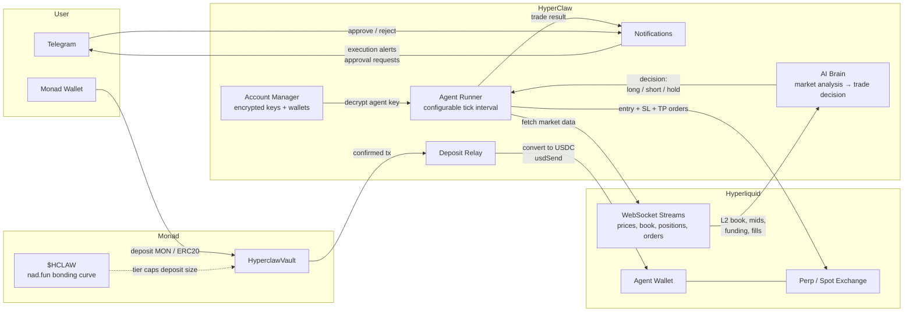

# HyperClaw

AI-powered autonomous trading agents on Hyperliquid, funded through on-chain vaults on Monad.

Users deposit into Monad smart contract vaults. Capital is relayed to Hyperliquid. AI agents trade perpetual futures autonomously, with configurable autonomy levels, risk parameters, and real-time monitoring. A native `$HCLAW` token governs deposit caps via a bonding-curve tier system.

---

## Table of Contents

- [Architecture](#architecture)
- [Core Concepts](#core-concepts)
- [Tech Stack](#tech-stack)
- [Pages and UI](#pages-and-ui)
- [API Surface](#api-surface)
- [Smart Contract](#smart-contract)
- [Project Structure](#project-structure)
- [Environment Variables](#environment-variables)
- [Setup](#setup)
- [Running](#running)
- [Deployment](#deployment)
- [Testnet Trading](#testnet-trading)

---

## Architecture



**Data flow:**

1. User deposits MON or ERC20 into `HyperclawVault` on Monad. `$HCLAW` market cap sets the deposit cap tier.
2. Deposit relay picks up the confirmed tx, converts value to USDC, sends it via `usdSend` to the agent's dedicated Hyperliquid wallet.
3. Agent runner ticks on a configurable interval. Each tick: pulls live market data from Hyperliquid WebSocket streams, passes it to the AI brain, receives a structured trade decision.
4. If confidence exceeds the agent's threshold, the runner places a full order set (market entry + stop-loss + take-profit) on Hyperliquid using the agent's own wallet.
5. In semi-auto mode, the decision is sent to Telegram first as an approval request. The user approves or rejects via inline buttons before execution.
6. All trades, decisions, and state are persisted and streamed to the frontend via SSE.

---

## Core Concepts

### Agents

Each agent is an independent trading entity with:

- **Dedicated Hyperliquid wallet** (generated on creation, key encrypted at rest)
- **Market selection** (perps and/or spot, e.g. BTC, ETH, SOL)
- **Risk parameters**: max leverage (1-50x), stop loss (1-25%), aggressiveness (0-100)
- **Autonomy mode**:
  - `full_auto` -- executes trades without human intervention
  - `semi_auto` -- requests approval via Telegram before executing
  - `manual` -- AI suggests, human executes
- **Status**: active, paused, stopped

### Vault System

- Share-based accounting on-chain via `HyperclawVault.sol`
- Multi-token deposits (native MON, WMON, USDT)
- Deposit caps scale with `$HCLAW` market cap:

| Tier      | Market Cap Threshold | Max Deposit per User |
|-----------|---------------------|---------------------|
| Hatchling | $0                  | $100                |
| Hunter    | $1,000              | $1,000              |
| Striker   | $10,000             | $10,000             |
| Apex      | $100,000            | $100,000            |

- Open Vault mode: public chat room for depositors, AI responds to investor questions

### AI Trading Brain

- Structured JSON output: action (long/short/hold), confidence, leverage, stop-loss, take-profit, reasoning
- Inputs: L2 order book, mid prices, funding rates, recent fills, portfolio state
- Minimum execution confidence: 0.6
- Risk tiers: Conservative (2-5% SL), Moderate (3-8% SL), Aggressive (5-15% SL)
- Model-agnostic interface via `lib/ai.ts` -- swap the underlying LLM without touching agent logic

### Account Manager

- AES-256-CBC encrypted private key storage in `.data/accounts.json`
- Supports trading accounts (with keys) and read-only accounts (address only)
- Per-agent wallet isolation

### Network Switching

- Runtime-switchable between Monad mainnet/testnet and Hyperliquid mainnet/testnet
- Persisted to localStorage on client, synced to server via API
- Wallet chain auto-switches on toggle

---

## Tech Stack

| Layer          | Technology                                    |
|----------------|-----------------------------------------------|
| Framework      | Next.js 14 (App Router)                       |
| Language       | TypeScript                                    |
| Styling        | Tailwind CSS, custom design system            |
| Auth           | Privy (embedded wallets, social login)        |
| Blockchain     | Viem, Wagmi (Monad EVM)                       |
| Exchange       | `@nktkas/hyperliquid` SDK                     |
| AI             | LLM via OpenAI-compatible API                 |
| Real-time      | WebSockets (Hyperliquid), SSE (client)        |
| State          | TanStack Query                                |
| Notifications  | Telegram Bot API, Web Push (VAPID)            |
| Storage        | Local JSON files (`.data/`) or AWS S3         |
| PWA            | Serwist (service worker, offline support)     |
| Contract       | Solidity 0.8.20                               |

---

## Pages and UI

| Route              | Purpose                                                        |
|--------------------|----------------------------------------------------------------|
| `/`                | Dashboard. TVL, PnL, active agents, HL wallets, $HCLAW tier   |
| `/agents`          | Agent list with status/autonomy/social filters                 |
| `/agents/new`      | Agent creation form: identity, markets, autonomy, risk, vault  |
| `/agents/[id]`     | Agent detail: overview, trades, deposit/withdraw, vault chat   |
| `/monitor`         | Real-time monitoring: positions, orders, book, prices, runner  |
| `/strategy`        | Strategy backtesting: configure params, run simulated ticks    |
| `/~offline`        | Offline fallback page (PWA)                                    |

Design system: dark terminal aesthetic. Neon green (`#30e8a0`, Hyperliquid), purple (`#836ef9`, Monad). Glassmorphism cards, ambient glow orbs, grid backgrounds, shimmer loading states.

---

## API Surface

### Agents

| Method | Route                            | Description                              |
|--------|----------------------------------|------------------------------------------|
| GET    | `/api/agents`                    | List all agents                          |
| POST   | `/api/agents`                    | Create agent (generates HL wallet)       |
| GET    | `/api/agents/[id]`               | Agent details + trade logs               |
| PATCH  | `/api/agents/[id]`               | Update agent config                      |
| POST   | `/api/agents/[id]/tick`          | Execute tick / start-stop runner         |
| GET    | `/api/agents/[id]/chat`          | Fetch vault chat messages                |
| POST   | `/api/agents/[id]/chat`          | Post message (AI responds if question)   |
| POST   | `/api/agents/[id]/approve`       | Approve/reject pending trade             |
| GET    | `/api/agents/orchestrator`       | Active agent IDs (EC2 orchestrator)      |

### Trading

| Method | Route                    | Description                          |
|--------|--------------------------|--------------------------------------|
| POST   | `/api/trade`             | Place order (market/limit/SL/TP)     |
| POST   | `/api/trade/cancel`      | Cancel order(s)                      |
| POST   | `/api/trade/leverage`    | Set leverage for a coin              |

### Funding

| Method | Route            | Description                                          |
|--------|------------------|------------------------------------------------------|
| POST   | `/api/deposit`   | Confirm Monad vault deposit tx                       |
| GET    | `/api/deposit`   | Query deposits, shares, TVL                          |
| POST   | `/api/fund`      | Provision/fund agent HL wallets, deposit/withdraw    |

### Market Data

| Method | Route            | Description                                     |
|--------|------------------|-------------------------------------------------|
| GET    | `/api/market`    | Mid prices, L2 book, funding, all markets       |

### Streaming (SSE)

| Route                        | Data                       |
|------------------------------|----------------------------|
| `/api/stream/positions`      | Live positions             |
| `/api/stream/orders`         | Live orders                |
| `/api/stream/balances`       | Live balances              |
| `/api/stream/prices`         | Live mid prices            |
| `/api/stream/book`           | Live L2 order book         |

### Other

| Method | Route                        | Description                        |
|--------|------------------------------|------------------------------------|
| GET    | `/api/token`                 | $HCLAW token state                 |
| GET    | `/api/network`               | Current network state              |
| POST   | `/api/network`               | Switch network                     |
| GET    | `/api/accounts`              | List HL accounts                   |
| POST   | `/api/accounts`              | Add/remove HL account              |
| POST   | `/api/telegram/webhook`      | Telegram bot webhook               |

---

## Smart Contract

**`contracts/HyperclawVault.sol`** -- Solidity 0.8.20

Multi-token vault on Monad. Share-based accounting. Deposit caps scale with `$HCLAW` market cap read from nad.fun bonding curve.

Key functions:

- `depositMON(agentId)` -- deposit native MON
- `depositERC20(token, amount, agentId)` -- deposit whitelisted ERC20
- `withdraw(agentId, shareBps)` -- withdraw proportional to shares (min 5%)
- `getUserSharePercent(agentId, user)` -- view share percentage
- `getVaultTvl(agentId)` -- view total vault value

Admin: `whitelistToken()`, `setHclawToken()`, `setNadFunLens()`

---

## Project Structure

```
hyperClaw/
├── app/
│   ├── page.tsx                    # Dashboard
│   ├── layout.tsx                  # Root layout (Privy, Wagmi, QueryClient)
│   ├── globals.css                 # Design system
│   ├── sw.ts                       # Service worker (Serwist)
│   ├── agents/
│   │   ├── page.tsx                # Agent list
│   │   ├── new/page.tsx            # Create agent
│   │   └── [id]/page.tsx           # Agent detail
│   ├── monitor/page.tsx            # Real-time monitor
│   ├── strategy/page.tsx           # Strategy backtester
│   ├── api/                        # All API routes (see API Surface)
│   └── components/
│       ├── Providers.tsx            # Privy + Wagmi + QueryClient
│       ├── NetworkContext.tsx        # Network state provider
│       ├── NetworkToggle.tsx        # Mainnet/testnet switch
│       ├── UseLoginPrivy.tsx        # Auth hook
│       ├── InstallPWA.tsx           # PWA install prompt
│       ├── SendNotification.tsx     # Web push
│       ├── monitor/                 # Monitor panels
│       │   ├── AgentRunnerPanel.tsx
│       │   ├── BalancePanel.tsx
│       │   ├── BookPanel.tsx
│       │   ├── OrderPanel.tsx
│       │   ├── PositionPanel.tsx
│       │   ├── PricePanel.tsx
│       │   └── QuickTrade.tsx
│       └── strategy/               # Strategy components
│           ├── StrategyBuilder.tsx
│           ├── BacktestResults.tsx
│           └── TestnetToggle.tsx
├── lib/
│   ├── types.ts                    # All type definitions, constants, tiers
│   ├── ai.ts                       # AI trade decision engine
│   ├── agent-runner.ts             # Autonomous execution loop
│   ├── hyperliquid.ts              # HL SDK wrapper (trading, data, wallets)
│   ├── account-manager.ts          # Encrypted multi-account management
│   ├── deposit-relay.ts            # Monad → Hyperliquid capital bridge
│   ├── vault.ts                    # Vault ABI and helpers
│   ├── hclaw.ts                    # $HCLAW token state and tier logic
│   ├── telegram.ts                 # Telegram bot (notifications, approvals)
│   ├── network.ts                  # Runtime network switching
│   ├── store-backend.ts            # Storage abstraction (local / S3)
│   ├── store.ts                    # Agent + trade data persistence
│   ├── watchers.ts                 # WebSocket stream managers
│   ├── sse.ts                      # SSE response helper
│   └── hooks/useSSE.ts             # Client-side SSE hook
├── contracts/
│   └── HyperclawVault.sol          # On-chain vault contract
├── .data/                          # Local JSON storage (gitignored in prod)
│   ├── agents.json
│   ├── trades.json
│   └── accounts.json
├── public/
│   ├── manifest.json               # PWA manifest
│   └── icons/                      # App icons
├── .env.example                    # All required env vars
├── vercel.json                     # Vercel function timeouts
├── next.config.mjs                 # Next.js + Serwist config
├── tailwind.config.ts              # Custom theme (dark terminal aesthetic)
└── package.json
```

---

## Environment Variables

Copy `.env.example` to `.env.local` and fill in values.

```bash
cp .env.example .env.local
```

| Variable                              | Required | Description                                           |
|---------------------------------------|----------|-------------------------------------------------------|
| `NEXT_PUBLIC_PRIVY_APP_ID`            | Yes      | Privy app ID from privy.io                            |
| `NEXT_PUBLIC_PRIVY_CLIENT_ID`         | No       | Privy client ID (optional)                            |
| `WEB_PUSH_EMAIL`                      | Yes      | VAPID contact email                                   |
| `WEB_PUSH_PRIVATE_KEY`               | Yes      | VAPID private key                                     |
| `NEXT_PUBLIC_WEB_PUSH_PUBLIC_KEY`    | Yes      | VAPID public key                                      |
| `HYPERLIQUID_PRIVATE_KEY`            | Yes      | Operator wallet private key (funds agent wallets)     |
| `NEXT_PUBLIC_HYPERLIQUID_TESTNET`    | No       | `"true"` for HL testnet (default: mirrors Monad)      |
| `RELAY_FEE_BPS`                      | No       | Deposit relay fee in basis points (default: 100 = 1%) |
| `OPENAI_API_KEY`                     | Yes      | API key for the AI trading brain                      |
| `AGENT_TICK_INTERVAL`                | No       | Agent runner interval in ms (default: 60000)          |
| `TELEGRAM_BOT_TOKEN`                 | No       | Telegram bot token from @BotFather                    |
| `ACCOUNT_ENCRYPTION_KEY`             | Yes      | AES-256-CBC key for stored private keys               |
| `NEXT_PUBLIC_VAULT_ADDRESS`          | Yes      | Deployed HyperclawVault contract address              |
| `MONAD_PRIVATE_KEY`                  | Yes      | Monad deployer/admin private key                      |
| `NEXT_PUBLIC_MONAD_TESTNET`          | No       | `"true"` for Monad testnet (default: true)            |
| `NEXT_PUBLIC_HCLAW_TOKEN_ADDRESS`    | No       | $HCLAW token address (after deployment)               |

**Production (Vercel + EC2):**

| Variable                  | Description                                    |
|---------------------------|------------------------------------------------|
| `AWS_S3_BUCKET`           | S3 bucket for persistent storage               |
| `AWS_REGION`              | AWS region (default: eu-north-1)               |
| `AWS_ACCESS_KEY_ID`       | AWS access key                                 |
| `AWS_SECRET_ACCESS_KEY`   | AWS secret key                                 |
| `ORCHESTRATOR_SECRET`     | Shared secret for EC2 orchestrator auth        |

---

## Setup

### Prerequisites

- Node.js >= 18
- npm
- Privy account ([privy.io](https://privy.io))
- AI API key (OpenAI-compatible endpoint)
- Hyperliquid-funded operator wallet (testnet: [app.hyperliquid-testnet.xyz](https://app.hyperliquid-testnet.xyz))

### Install

```bash
git clone https://github.com/your-org/hyperClaw.git
cd hyperClaw
npm install
```

### Generate VAPID Keys

```bash
npx web-push generate-vapid-keys --json
```

Copy output to `WEB_PUSH_PRIVATE_KEY` and `NEXT_PUBLIC_WEB_PUSH_PUBLIC_KEY` in `.env.local`.

### Configure Privy

1. Create app at [privy.io](https://privy.io), platform: Web.
2. Copy App ID to `NEXT_PUBLIC_PRIVY_APP_ID`.

### Deploy Vault Contract

Deploy `contracts/HyperclawVault.sol` to Monad (testnet or mainnet). Set the deployed address in `NEXT_PUBLIC_VAULT_ADDRESS`.

---

## Running

### Development

```bash
npm run dev
```

Runs at `http://localhost:3000`. PWA install prompts require production build.

### Production

```bash
npm run build && npm run start
```

### Lint

```bash
npm run lint
```

---

## Deployment

### Vercel

The app deploys to Vercel. `vercel.json` sets extended timeouts for agent tick (60s) and orchestrator (10s) routes.

Storage: In serverless (Vercel), local filesystem is ephemeral. Set `AWS_S3_BUCKET` and AWS credentials to use S3 for persistent `.data/` storage.

### EC2 Orchestrator

For autonomous agent execution at scale, run an EC2 instance that polls `/api/agents/orchestrator` for active agents and calls `/api/agents/[id]/tick` on intervals. Authenticate with the `ORCHESTRATOR_SECRET` header.

---

## Testnet Trading

See [TESTNET_TRADING.md](./TESTNET_TRADING.md) for the full testnet trading checklist.

Short version:

1. Set `NEXT_PUBLIC_HYPERLIQUID_TESTNET=true` in `.env`.
2. Fund operator wallet on HL testnet.
3. Create an agent with markets and set it to Active.
4. Fund the agent's HL wallet via the Deposit tab or Fund API.
5. Trigger a tick (manual button, API call, or start the autonomous runner).
6. Verify trades on agent detail page or HL testnet explorer.

---

## License

MIT
